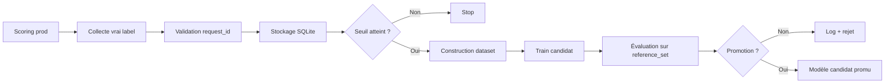

# M6-B2 — Boucle de rétroaction Pyrenex

## 🚀 Démarrage rapide

```bash
python -m venv .venv
source .venv/bin/activate  # ou .venv\Scripts\activate sous Windows
pip install -r requirements.txt
pytest -q tests
pytest -q services/model/tests/test_api.py
python scripts/retrain.py --min-feedback 200
```

Le repo met à disposition les données et modèles suivants :

- `data/feedbacks_simules.csv`
- `data/feedbacks.db`
- `data/prod_scored.csv`
- `data/lending_club_train.csv`
- `data/reference_set.csv`
- `models/pyrenex_risk_v2.joblib`

## 🔁 Boucle de rétroaction



La logique est la suivante :

- un vrai label est collecté depuis l’API de feedback
- il est validé et stocké
- les feedbacks non consommés sont comptés
- lorsque le seuil est atteint, un candidat est entraîné
- le candidat et le modèle de production sont comparés sur le même `reference_set`
- le modèle est promu uniquement selon la politique métier codée

## 🧩 Composants du projet

### Feedback API

Le service dans `services/feedback/app/main.py` expose :

- `POST /feedback`
- `GET /feedback/count`
- `GET /health`

Il valide :

- `request_id` connu
- label `0` ou `1`
- idempotence sur doublon exact
- rejet en cas de contradiction

### Réentraînement

Le script dans `scripts/retrain.py` :

- charge les feedbacks SQLite
- compte les feedbacks non consommés
- construit le dataset d’apprentissage
- entraîne un candidat séparé
- évalue candidat et production sur le même `reference_set`
- applique `decide_promotion()`
- journalise la décision dans `decisions_log.jsonl`
- ne crée un artefact promu que si la décision est positive

### Politique de promotion

La fonction dans `scripts/promotion.py` applique la règle métier :

- plancher de qualité absolu
- tolérance de régression sur `f1_macro` et `recall_default`
- gain minimum exigé
- promotion uniquement si le candidat est au moins aussi bon que le modèle actuel sur les métriques critiques

## ✅ Critères de réussite

- le service de feedback accepte et valide les vrais labels
- un seuil de 200 nouveaux feedbacks déclenche bien le retrain
- le candidat est évalué sur le même référentiel que la production
- un rejet est une décision normale, pas un bug
- un modèle candidat n’est promu qu’après validation métier

## 🔔 Trigger de production

Le trigger est documenté dans `crontab_TEMPLATE.txt` et le workflow GitHub Actions est fourni dans `.github/workflows/retrain.yml`.

Exemple de cron :

```bash
0 */6 * * * cd /opt/pyrenex && .venv/bin/python scripts/retrain.py --min-feedback 200 >> logs/retrain.log 2>&1
```

Le workflow `retrain-on-feedback-threshold` se déclenche :

- manuellement via `workflow_dispatch`
- automatiquement toutes les 6 heures via cron

## 📌 Décision métier actuelle

Le document de décision métier est dans `decisions.md`.

La politique retenue est la suivante :

- `f1_macro >= 0.60`
- `recall_default >= 0.60`
- tolérance de régression = `0.01`
- gain minimum = `0.01`

Toute promotion doit être justifiée par ces seuils et par la comparaison sur le même `reference_set`.

## 📚 Ressources

- `decisions.md` : décision de business et justification du seuil
- `scripts/promotion.py` : règle de promotion pure
- `scripts/retrain.py` : retraining déclenché par seuil
- `services/feedback/app/main.py` : collecte des vrais labels
- `services/model/app/main.py` : API modèle M6
